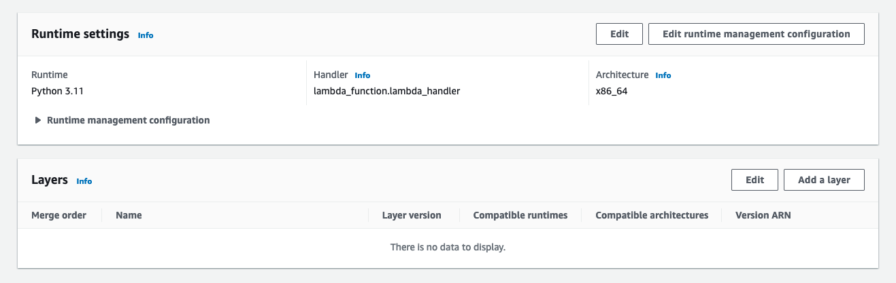

You can also install Sentry using a [Lambda Layer](https://docs.aws.amazon.com/lambda/latest/dg/configuration-layers.html).

Navigate to your Lambda function:

Scroll down to the **Layers** section and click **Add a Layer**:

**Specify an ARN** tab as illustrated:

Finally, set the region and copy the provided ARN value into the input.

<LambdaLayerDetail canonical="aws-layer:python" />

That's it.

Now when there are unhandled errors in your Lambda function they will be captured and sent to Sentry.
