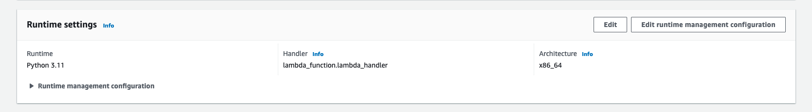
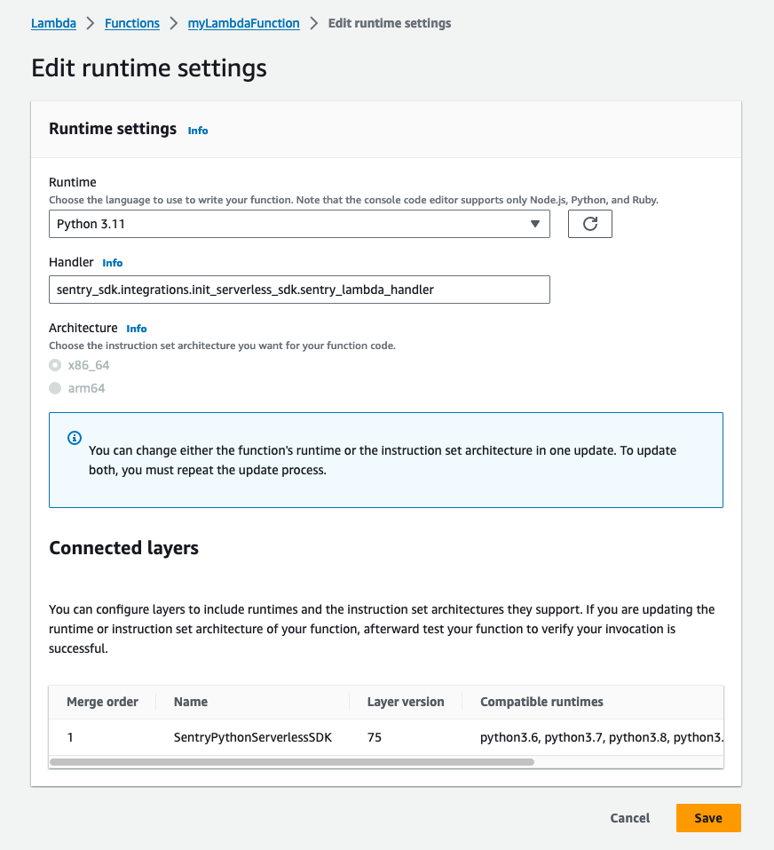
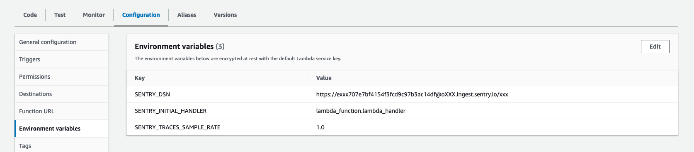

You can add Sentry to your AWS Lambda function by adding the Sentry AWS Lambda Layer to your function.

## Install the layer

Navigate to your Lambda function:

Scroll down to the **Layers** section and click **Add a Layer**:

**Specify an ARN** tab as illustrated:

Finally, set the region and copy the provided ARN value into the input.

<LambdaLayerDetail canonical="aws-layer:python" />

## Configure the Sentry SDK

For Sentry to instrument your Lambda function you need to change the handler of your function and set the Sentry DSN using environment variables.

### Set the Sentry Handler

The Sentry layer will wrap your function handler to initialise the Sentry SDK in your function.

In you Lambda function scroll to **Runtime settings** and click **Edit**:

Note your current **Handler** and change it to `sentry_sdk.integrations.init_serverless_sdk.sentry_lambda_handler`:

After saving open the "Configuration" tab of your Lambda function and set `SENTRY_INITIAL_HANDLER` to the handler you noted before:

### Configuration Options

Make sure that at least `SENTRY_DSN` and `SENTRY_INITIAL_HANDLER` (see "Set the Sentry Handler" above) is set in your environment.

<PlatformContent includePath="aws-lambda-environment" />

## Verify

Deriberately add an error to you function and run it. The error is now captured and sent to Sentry.io
