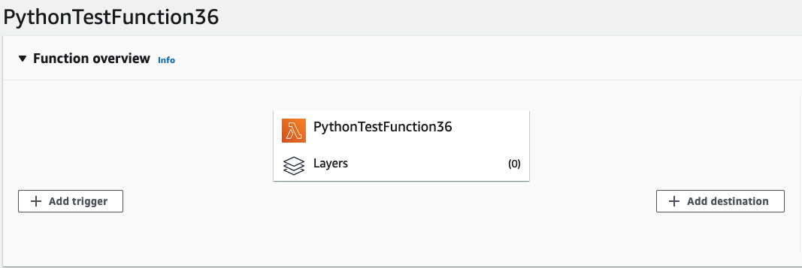
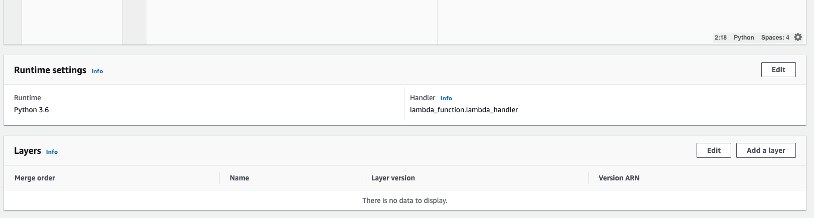
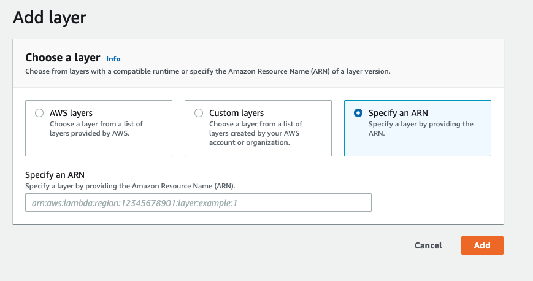

You can also install Sentry using a [Lambda Layer](https://docs.aws.amazon.com/lambda/latest/dg/configuration-layers.html) instead of installing `sentry_sdk` with `pip`. Import Sentry as usual:

```python
import sentry_sdk
```

Then add the Sentry Layer by navigating to your Lambda function. Select **Layers**.



Then **Add a Layer**.



**Specify an ARN** tab as illustrated:



Finally, set the region and copy the provided ARN value into the input.

<LambdaLayerDetail canonical="aws-layer:python" />
