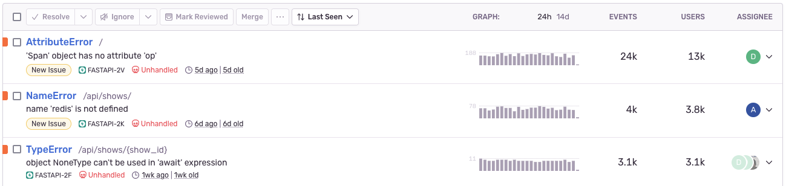
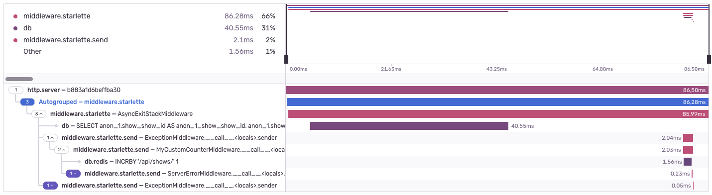

The FastAPI integration adds support for the [FastAPI Framework](https://fastapi.tiangolo.com/).

## Install

Install `sentry-sdk` from PyPI with the `fastapi` extra:

```bash
pip install --upgrade 'sentry-sdk[fastapi]'
```

## Configure

To configure the Sentry SDK, initialize it before your app has been initialized:

```python
from fastapi import FastAPI

import sentry_sdk


sentry_sdk.init(
    dsn="___PUBLIC_DSN___",

    # Set traces_sample_rate to 1.0 to capture 100%
    # of transactions for performance monitoring.
    # We recommend adjusting this value in production,
    traces_sample_rate=1.0,
)

app = FastAPI()
```

## Verify

This snippet includes an intentional error, so you can test that everything is working as soon as you set it up:

```python
from fastapi import FastAPI


app = FastAPI()

@app.get("/sentry-debug")
async def trigger_error():
    division_by_zero = 1 / 0

```

Visiting `"/sentry-debug"` will trigger an error that will be captured by Sentry.

## Behavior

### Issue Reporting

The following information about your FastAPI project will be available to you on Sentry.io:

- All exceptions leading to an Internal Server Error are captured and reported.
- Request data such as URL, HTTP method, headers, form data, and JSON payloads is attached to all issues.
- Sentry excludes raw bodies and multipart file uploads.
- Sentry also excludes personally identifiable information (such as user ids, usernames, cookies, authorization headers, IP addresses) unless you set `send_default_pii` to `True`.



### Monitor Performance

The following parts of your FastAPI project are monitored:

- Middleware stack
- Middleware `send` and `receive` callbacks
- Database queries
- Redis commands



<Note>

The parameter `traces_sample_rate` needs to be set when initializing the Sentry SDK for performance monitoring to be enabled.

</Note>

## Integration Options

If you want to change the default behavior of the FastAPI integration, you need to instantiate the integration manually and then pass it to Sentry's `init` function. Because FastAPI is based on the Starlette framework, both integrations, `StarletteIntegration` and `FastApiIntegration`, must be instantiated.

<ConfigKey name="transaction_style">

You can pass the keyword argument `transaction_style` to `StarletteIntegration()` and `FastApiIntegration()`.

With this option, you can influence how the transactions are named in Sentry. For example:

```python
from sentry_sdk.integrations.starlette import StarletteIntegration
from sentry_sdk.integrations.fastapi import FastApiIntegration

sentry_sdk.init(
    # ...
    integrations=[
        StarletteIntegration(transaction_style="endpoint"),
        FastApiIntegration(transaction_style="endpoint"),
    ],
)

app = FastAPI()

@app.get("/catalog/product/{product_id}")
async def product_detail(product_id):
    return {...}
```

In the above code, the transaction name will be:

- `"/catalog/product/{product_id}"` if you set `transaction_style="url"`
- `"product_detail"` if you set `transaction_style="endpoint"`

The default is `"url"`.

</ConfigKey>

## Data Collected

### Data Collected by Issue Reporting

|                                                                                                                                                   | Send PII: Off <br/>`(send_default_pii=False)` <br/>(DEFAULT)                                             | Send PII: On <br/>`(send_default_pii=True)` <br/>&nbsp;                                                                                                                       |
| ------------------------------------------------------------------------------------------------------------------------------------------------- | -------------------------------------------------------------------------------------------------------- | ----------------------------------------------------------------------------------------------------------------------------------------------------------------------------- |
|                                                                                                                                                   |                                                                                                          |                                                                                                                                                                               |
| Data sent when an <br/> unhandled error occurs                                                                                                    | <span style="color: #C83852;">Yes</span>                                                                 | <span style="color: #C83852;">Yes</span>                                                                                                                                      |
| Data sent on <br/> each request                                                                                                                   | <span style="color: #69C289;">No</span>                                                                  | <span style="color: #69C289;">No</span>                                                                                                                                       |
| HTTP headers                                                                                                                                      | <span style="color: #69C289;">Not Sent</span>                                                            | <span style="color: #D79528;">Sent <br/> ([Denylist](https://github.com/getsentry/sentry-python/blob/master/sentry_sdk/integrations/_wsgi_common.py#L19-L26) applied) </span> |
| Cookies                                                                                                                                           | <span style="color: #69C289;">Not Sent</span>                                                            | <span style="color: #D79528;">Sent</span>                                                                                                                                     |
| Information about logged-in user<br/>(user id, user name, email)                                                                                  | <span style="color: #69C289;">Not Sent</span>                                                            | <span style="color: #C83852;">Sent</span>                                                                                                                                     |
| Users' IP address                                                                                                                                 | <span style="color: #69C289;">Not Sent</span>                                                            | <span style="color: #C83852;">Sent</span>                                                                                                                                     |
| Request URL                                                                                                                                       | <span style="color: #C83852;">Sent <br/><small>(If route can not be found in ASGI scope.)</small></span> | <span style="color: #C83852;">Sent <br/><small>(If route can not be found in ASGI scope.)</small></span>                                                                      |
| Request query string                                                                                                                              | <span style="color: #C83852;">Sent </span>                                                               | <span style="color: #C83852;">Sent </span>                                                                                                                                    |
| Request body<br/><small>(Turn off with ["request_bodies"](/platforms/python/guides/django/configuration/options/#request-bodies) option.)</small> | <span style="color: #C83852;">Sent</span>                                                                | <span style="color: #C83852;">Sent</span>                                                                                                                                     |
| Local variables in stack trace<br/><small>(Turn off with ["with_locals"](/platforms/python/configuration/options/#with-locals) option.)</small>   | <span style="color: #C83852;">Sent</span>                                                                | <span style="color: #C83852;">Sent</span>                                                                                                                                     |
| Performance spans                                                                                                                                 | <span style="color: #69C289;">Not Sent</span>                                                            | <span style="color: #69C289;">Not Sent</span>                                                                                                                                 |

### Data Collected by Performance Monitoring

<Note>

The parameter `traces_sample_rate` needs to be set when initializing the Sentry SDK to monitor performance.

</Note>

|                                                                                                                                                   | Send PII: Off <br/>`(send_default_pii=False)` <br/>(DEFAULT)                                             | Send PII: On <br/>`(send_default_pii=True)` <br/>&nbsp;                                                                                                                      |
| ------------------------------------------------------------------------------------------------------------------------------------------------- | -------------------------------------------------------------------------------------------------------- | ---------------------------------------------------------------------------------------------------------------------------------------------------------------------------- |
|                                                                                                                                                   |                                                                                                          |                                                                                                                                                                              |
| Data sent when an <br/> unhandled error occurs                                                                                                    | <span style="color: #C83852;">Yes</span>                                                                 | <span style="color: #C83852;">Yes</span>                                                                                                                                     |
| Data sent on <br/> each request                                                                                                                   | <span style="color: #C83852;">Yes</span>                                                                 | <span style="color: #C83852;">Yes</span>                                                                                                                                     |
| HTTP headers                                                                                                                                      | <span style="color: #69C289;">Not Sent</span>                                                            | <span style="color: #D79528;">Sent <br/> ([Denylist](https://github.com/getsentry/sentry-python/blob/master/sentry_sdk/integrations/_wsgi_common.py#L19-L26) applied)</span> |
| Cookies                                                                                                                                           | <span style="color: #69C289;">Not Sent</span>                                                            | <span style="color: #D79528;">Sent</span>                                                                                                                                    |
| Information about logged-in user<br/>(user id, user name, email)                                                                                  | <span style="color: #69C289;">Not Sent</span>                                                            | <span style="color: #C83852;">Sent</span>                                                                                                                                    |
| Users' IP address                                                                                                                                 | <span style="color: #69C289;">Not Sent</span>                                                            | <span style="color: #C83852;">Sent</span>                                                                                                                                    |
| Request URL                                                                                                                                       | <span style="color: #C83852;">Sent <br/><small>(If route can not be found in ASGI scope.)</small></span> | <span style="color: #C83852;">Sent <br/><small>(If route can not be found in ASGI scope.)</small></span>                                                                     |
| Request query string                                                                                                                              | <span style="color: #C83852;">Sent </span>                                                               | <span style="color: #C83852;">Sent </span>                                                                                                                                   |
| Request body<br/><small>(Turn off with ["request_bodies"](/platforms/python/guides/django/configuration/options/#request-bodies) option.)</small> | <span style="color: #C83852;">Sent</span>                                                                | <span style="color: #C83852;">Sent</span>                                                                                                                                    |
| Local variables in stack trace<br/><small>(Turn off with ["with_locals"](/platforms/python/configuration/options/#with-locals) option.)</small>   | <span style="color: #C83852;">Sent</span>                                                                | <span style="color: #C83852;">Sent</span>                                                                                                                                    |
| Performance spans                                                                                                                                 | <span style="color: #C83852;">Sent</span>                                                                | <span style="color: #C83852;">Sent</span>                                                                                                                                    |

## Supported Versions

- FastAPI: 0.79.0+
- Python: 3.7+
