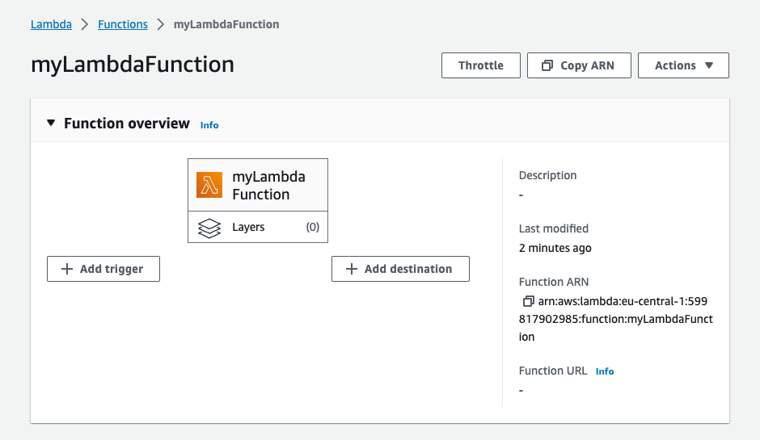
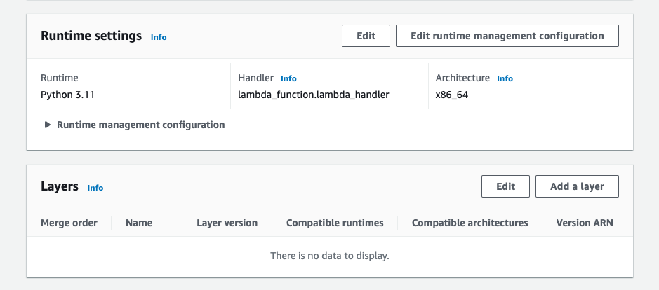
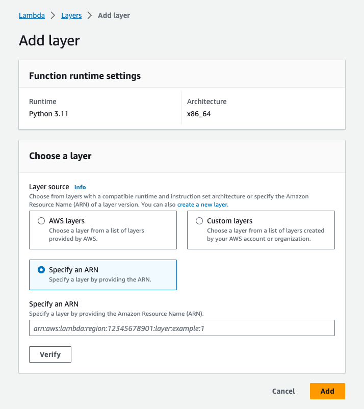
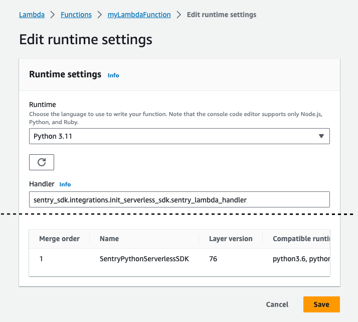
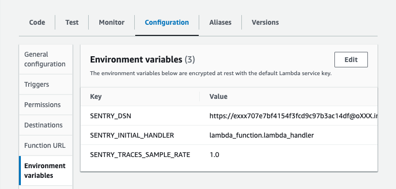

You can add Sentry to your AWS Lambda function by adding the Sentry AWS Lambda Layer to your function.

## Install The Layer

Navigate to your Lambda function:

Scroll down to the **Layers** section and click **Add a Layer**:

**Specify an ARN** tab as illustrated:

First, set the region and copy the provided ARN value:

<LambdaLayerDetail canonical="aws-layer:python" />

Now copy that ARN into the input box:

## Configure the Sentry SDK

For Sentry to instrument your Lambda function, you need to change the handler of your function and set the Sentry DSN using environment variables.

### Set the Sentry Handler

The Sentry layer will wrap your function handler to initialise the Sentry SDK in your function.

In you Lambda function, scroll to **Runtime settings** and click **Edit**:

Note your current **Handler** and change it to: `sentry_sdk.integrations.init_serverless_sdk.sentry_lambda_handler`:

After saving, open the "Configuration" tab of your Lambda Function and set `SENTRY_INITIAL_HANDLER` to the handler you noted before:

### Configuration Options

Make sure that `SENTRY_DSN` and `SENTRY_INITIAL_HANDLER` are set in your environment at minimum. See "Set the Sentry Handler" above for more information.

<PlatformContent includePath="aws-lambda-environment" />

## Verify

Add an error to you function and run it. If everything's working properly, it should be captured and sent to Sentry.io.

## Supported Versions

- Lambda Layer up to Version 63: Python 3.6, 3.7, 3.8, 3.9
- Lambda Layer Version 64+: Python 3.9, 3.10, 3.11
