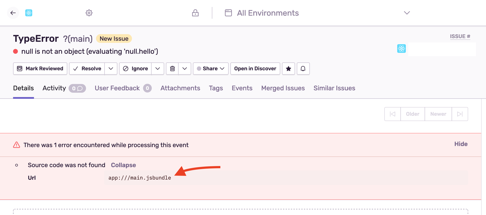

To get unminified stack traces for JavaScript code, source maps must be generated and uploaded. The React Native SDK handles source maps _automatically_ for iOS with Xcode and Android with Gradle. However, if you use custom values for your release other than the version included with the build in XCode or Android Studio, you will need to manually upload sourcemaps.

### The Release and Distribution

For events sent from Sentry to correctly be attributed to a release and subsequently its sourcemaps, **both the `release` and `dist` values will need to be set.** You can set these values in the call to `init` which you can read about in [Releases & Health](/platforms/react-native/configuration/releases/).

## Preparing the Source Maps for a Release

You will need to generate and upload the sourcemaps for every release of your app for the events sent to be correctly unminified.

### Configure CLI

Configure the CLI by reviewing the [configuration guide](https://docs.sentry.io/product/cli/configuration/) for CLI commands.

### Generating the Bundle and Sourcemaps

You would use the React Native CLI to generate the JavaScript bundle and sourcemaps for your app:

```bash {tabTitle:Android}
react-native bundle \
  --dev false \
  --platform android \
  --entry-file index.android.js \
  --bundle-output index.android.bundle \
  --sourcemap-output index.android.bundle.map
```

```bash {tabTitle:iOS}
react-native bundle \
  --dev false \
  --platform ios \
  --entry-file index.ios.js \
  --bundle-output main.jsbundle \
  --sourcemap-output main.jsbundle.map
```

[You can read more about the React Native CLI Bundle command here.](https://github.com/react-native-community/cli/blob/master/docs/commands.md#bundle)

#### Input

You would pass your entry file to `--entry-file` for Android or iOS respectively. By default this file is usually named `index.js`. It is often `index.android.js` and `index.ios.js` for Android and iOS respectively.

#### Outputs

This will output your bundle file and sourcemaps. By default these files are called

- iOS: `main.jsbundle` and `main.jsbundle.map`
- Android: `index.android.bundle` and `index.android.bundle.map`

<Note>
Make sure that the sourcemap's name is the bundle's name + ".map" for sourcemaps to correctly be detected.
</Note>

### Uploading the Bundle and Sourcemaps

```bash {tabTitle:Android}
node_modules/@sentry/cli/bin/sentry-cli releases \
    files <release> \
    upload-sourcemaps \
    --dist <dist> \
    --strip-prefix /path/to/project/root \
    --rewrite index.android.bundle index.android.bundle.map
```

```bash {tabTitle:iOS}
node_modules/@sentry/cli/bin/sentry-cli releases \
    files <release> \
    upload-sourcemaps \
    --dist <dist> \
    --strip-prefix /path/to/project/root \
    --rewrite main.jsbundle main.jsbundle.map
```

<Note>

If you're using `sentry-cli` prior to version 1.59.0, pass `--rewrite` to the `upload-sourcemaps` command to fix up the source maps before the upload (inlines sources and so forth). Version 1.59.0 does this automatically.

</Note>

## Troubleshooting

If source maps are still not recognized, check for warnings similar to:



The bundle filename needs to match the filename on the event (and shown on the warning) to correctly apply the source maps.
