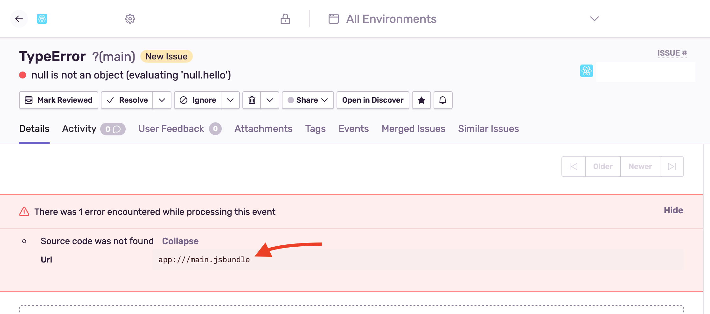

To get unminified stack traces for JavaScript code, source maps must be generated and uploaded. The React Native SDK handles source maps _automatically_ for iOS with Xcode and Android with Gradle, if you do not use custom values.

## Using custom Release and Distribution

However, if you use custom values for your release other than the version included with the build in Xcode or Android Studio, the automatic source maps upload script will no longer work because it does not detect custom values. As a result, you'll need to manually upload source maps using these steps:

### 1. Set the Release and Distribution

For events sent from Sentry to correctly be attributed to a release and subsequently its source maps, **both the `release` and `dist` values will need to be set.** You can set these values in the call to `init`, as discussed in our [Releases & Health content](/platforms/react-native/configuration/releases/).

<Note>

Before disabling the automatic source maps upload, you can set the `release` and `dist` as environment variables, `SENTRY_RELEASE` and `SENTRY_DIST` respectively. The script that performs the automatic source maps upload will use those values instead the default ones, and they will match the given `release` and `dist`. This ensures that the given custom `release` and `dist` values are used.

</Note>

```bash
export SENTRY_RELEASE="my-project-name@2.3.12"
export SENTRY_DIST="52"
```

If you've exported the environment variables and they match the given `release` and `dist` during the `Sentry.init` call, you can skip the next steps.

### 2. Disable the automatic source maps upload script

When you set a custom release or manually upload source maps, you will need to disable the automatic source map upload script:

- In iOS, [revert the build script "Bundle React Native code and images"](/platforms/react-native/manual-setup/manual-setup/#bundle-react-native-code-and-images).

- In Android, [remove the gradle integration](/platforms/react-native/manual-setup/manual-setup/#enable-gradle-integration).

## Preparing Source Maps for a Release

You need to generate and upload the source maps at build time for **every release** of your app for the events sent to be correctly unminified. To do so, follow these steps:

### 1. Configure CLI

Configure the CLI by reviewing the [configuration guide](/product/cli/configuration/) for CLI commands.

### 2. Generate the bundle and source maps

<Alert level="warning" title="Hermes">

If you use the **Hermes engine**, you will need to [follow this guide to compile source maps for Hermes](/platforms/react-native/manual-setup/hermes/#custom-source-maps).

</Alert>

You can use the React Native CLI to generate the JavaScript bundle and source maps for your app:

```bash {tabTitle:Android}
react-native bundle \
  --dev false \
  --platform android \
  --entry-file index.android.js \
  --reset-cache \
  --bundle-output index.android.bundle \
  --sourcemap-output index.android.bundle.map
```

```bash {tabTitle:iOS}
react-native bundle \
  --dev false \
  --platform ios \
  --entry-file index.ios.js \
  --reset-cache \
  --bundle-output main.jsbundle \
  --sourcemap-output main.jsbundle.map
```

[Learn more about the React Native CLI bundle command](https://github.com/react-native-community/cli/blob/master/docs/commands.md#bundle).

#### 2.1 Pass your entry file

Pass your entry file to `--entry-file` for Android or iOS, respectively. By default, this file is usually named `index.js`. It is often named `index.android.js` for Android or `index.ios.js` for iOS.

#### 2.2 Output your bundle files and source maps

These files will output your bundle and source maps. By default, these files are named `index.android.bundle` and `index.android.bundle.map` for Android and `main.jsbundle` and `main.jsbundle.map` for iOS.

<Note>

The source map's name must be the bundle's name appended with `.map` for source maps to correctly be detected.

</Note>

### 3. Upload the bundle and source maps

```bash {tabTitle:Android}
node_modules/@sentry/cli/bin/sentry-cli releases \
    files <release> \
    upload-sourcemaps \
    --dist <dist> \
    --strip-prefix /path/to/project/root \
    index.android.bundle index.android.bundle.map
```

```bash {tabTitle:iOS}
node_modules/@sentry/cli/bin/sentry-cli releases \
    files <release> \
    upload-sourcemaps \
    --dist <dist> \
    --strip-prefix /path/to/project/root \
    main.jsbundle main.jsbundle.map
```

<Note>

If you're using `sentry-cli` prior to version 1.59.0, pass `--rewrite` to the `upload-sourcemaps` command to fix up the source maps before the upload (inlines sources and so forth). Version 1.59.0 does this automatically.

</Note>

## Troubleshooting

If source maps are still not recognized, check for warnings similar to:



The bundle filename needs to match the filename on the event (and shown on the warning) to correctly apply the source maps.

Find more troubleshooting cases in our [Troubleshooting documentation](/platforms/react-native/troubleshooting/#source-maps).
