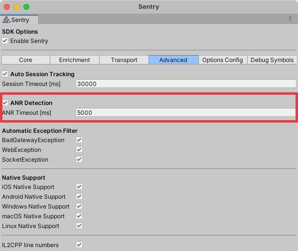

Application Not Responding (ANR) errors are triggered when the Unity thread of the game is blocked for more than five seconds. The Unity SDK reports ANR errors as Sentry events. In addition, Sentry calculates [ANR rate](/platforms/unity/performance/instrumentation/performance-metrics/#application-not-responding-anr-rate) based on these events and user sessions.

## ANR implementation details

The ANR detection in the Unity SDK strictly works within the Unity game, ireespecitve of the targeted platform and works in two parts. First the SDK starts a coroutine that periodically notes the time it last got called. Second, a background thread checks the time since the last update against the ANR threshold from the options.
The detection is sensitive of the app losing and regaining focus and gets paused accordingly. It is also using `WaitForSecondsRealtime` so pausing your game by modifying the `Time.timeScale` will not trigger false ANR reports.

On platforms that do no support multithreading the ANR detection falls back to relying on the coroutine itself to report if the last time it executed exceeds the timeout.

## Configuration

The ANR detection is enabled by default. You can opt-out through the editor window `Tools -> Sentry -> Advanced -> ANR Detection`. You can also set the ANR timeout there.



Because the ANR detection is enabled by default you can opt out by disabling the integration.

```csharp
options.DisableAnrIntegration();
```

You can access setting the timeout with the following snippet.

```csharp
options.AnrTimeout = TimeSpan.FromSeconds(5);
```
