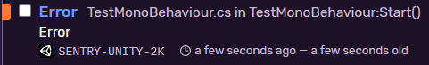

<Note>

This is a `preview` version. We're looking for your feedback! If you want to use a stable version, please refer to <Link to="/platforms/unity/unity-lite/">Unity Lite</Link>.

</Note>

On this page, we get you up and running with Sentry's SDK, so that it will automatically report errors and exceptions in your application.

<Note>

If you don't already have an account and Sentry project established, head over to [sentry.io](https://sentry.io/signup/), then return to this page.

</Note>

<PlatformContent includePath="framework-list" />

## Install

Sentry captures data by using an SDK within your application’s runtime. 

Install it from [`Unity UPM`](https://docs.unity3d.com/Manual/upm-ui.html) via [git url](https://docs.unity3d.com/Manual/upm-ui.html)

```
https://github.com/getsentry/sentry-unity.git?path=/package#{{ packages.version('sentry.dotnet.unity', '0.0.5') }}
```

<Note>

Confirm there's no empty space at the end of the line. The Unity Package Manager will fail to find the package if an empty space is appended to the end of the URL.

</Note>

## Configure

Configuration should happen as early as possible in your application's lifecycle. Currently, there is only one approach to configure Sentry - Unity tools window.

Open `Tools` -> `Sentry`. 

The first time you open the window, needed Unity Sentry SDK related files will be created: 

* `Assets/Resources/Sentry/SentryOptions.json` - Sentry settings
* `Assets/Resources/Sentry/link.xml` - [a special file](https://docs.unity3d.com/Manual/ManagedCodeStripping.html) for [ILL2CPP](https://docs.unity3d.com/Manual/IL2CPP.html) builds


Sentry configuration window will be opened.


* `Enable` - enable Sentry events capturing
* `DSN` - Sentry DSN value

After you close the window, all settings will be saved into `Assets/Resources/Sentry/SentryOptions.json`.

## Verify

Create `TestMonoBehaviour.cs` which contains intentional error (in this case `Debug.LogError`, but can be any exception):

```csharp
using UnityEngine;

public class TestMonoBehaviour : MonoBehaviour
{
    void Start()
    {
        Debug.Log("Log");
        Debug.LogWarning("Warning");
        Debug.LogError("Error");
    }
}
```

Assign it to any object you have in the scene and hit play. Open up your Sentry project in web UI and check the logs. 

You should see a new issue:



Open it up and check breadcrumbs:


The list of captured events are displayed.

### Event debouncer

There is a debouncing mechanism in place. It means that if you try to send a bunch of requests in a quick succession (with the same log type), we will take the first one and ignore the other ones given some time slot.

Current settings:

* `LogType.Error` (also exceptions) or `LogType.Exception` or `LogType.Assert` - 1 second
* `LogType.Log` - 1 second
* `LogType.Warning` - 1 second

Create another `DebouncerTestMonoBehaviour.cs` assign to any object in the scene and run it.

```csharp
using UnityEngine;

public class DebouncerTestMonoBehaviour : MonoBehaviour
{
    void Start()
    {
        Debug.Log("Log");             // recorded
        Debug.Log("Log2");            // not recorded (1 second didn't expire from the previous call)
        Debug.LogWarning("Warning");  // recorded
        Debug.LogWarning("Warning2"); // not recorded
        Debug.LogError("Error");      // recorded
    }
}
```

<Note>

Learn more about manually capturing an error or message, in our <PlatformLink to="/enriching-events/breadcrumbs/">Usage documentation</PlatformLink>.

</Note>

To view and resolve the recorded error, log into [sentry.io](https://sentry.io) and open your project. Clicking on the error's title will open a page where you can see detailed information and mark it as resolved.
