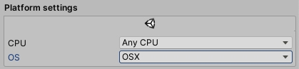

Then you're exporting your game for iOS Sentry modifies the generated Xcode project to add native support. To do that it relies on Unity's iOS module. That reliance can lead to [issues](/platforms/unity/troubleshooting/#sentryunityeditorios---systemreflectionreflectiontypeloadexception) when the module is not installed. To not require users on all platforms to install the iOS module we've set the default platform settings for `Sentry.Unity.Editor.iOS.dll` to OSX. If you want to export the Xcode project on a non OSX platform and you want Sentry native support you first have to [embed](https://docs.unity3d.com/Manual/upm-embed.html) the Sentry SDK package so that you then can modify the import settings in the inspector at `Packages/Sentry/Editor/iOS/Sentry.Unity.Editor.iOS.dll` to your desired platform.

