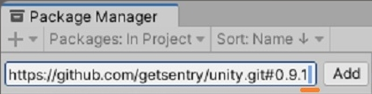
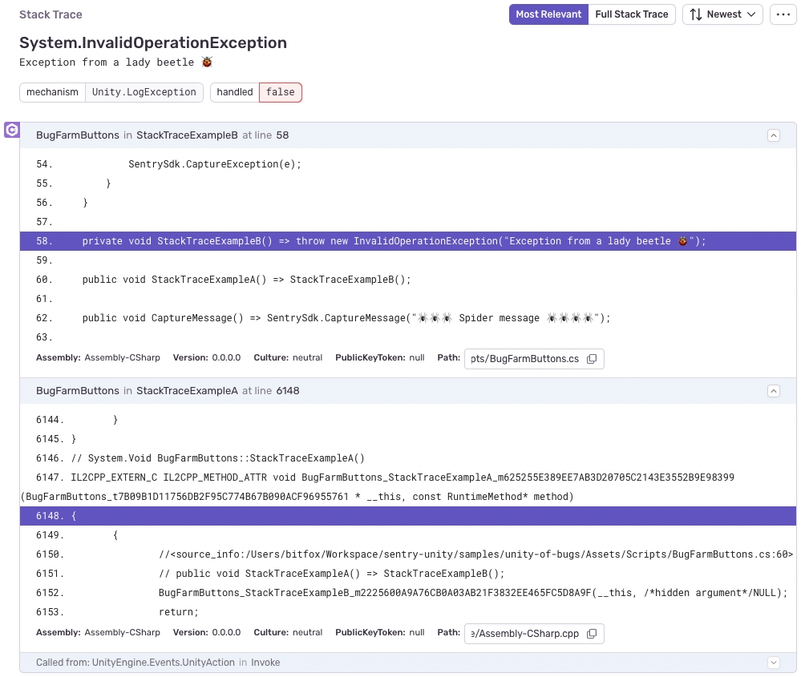

## Installation Issues

### Package Manager - `Cannot perform upm operation: Unable to add package`

If you encounter the following error:

```
[Package Manager Window] Unable to add package [https://github.com/getsentry/unity.git#0.9.1 ]:
  Error when executing git command. fatal: invalid refspec '0.9.1 '
```

Confirm the URL doesn't have a trailing whitespace or spaces in the URL. The Unity Package Manager will fail to find the package if whitespace is appended.



### Package Manager - `'HEAD': cannot update ref 'refs/heads/master'`

Some Unity versions, such as `2019.4.24f1` and `2020.3.2f1`, have a bug on UPM and fail to install with the error `'HEAD': cannot update ref 'refs/heads/master'`.
Unity has resolved this issue on newer releases. Learn more by checking the [Unity Issue Tracker](https://issuetracker.unity3d.com/issues/package-resolution-error-when-using-a-git-dependency-referencing-an-annotated-tag-in-its-git-url).

### PrecompiledAssemblyException: `Multiple precompiled assemblies with the same name`

This issue was resolved in the release 0.7.0 of the Sentry SDK for Unity.
If you're still encountering this issue on a version later than 0.7.0, please let us know [with an issue report](https://github.com/getsentry/sentry-unity/issues/new?assignees=&labels=&template=BUG_REPORT.md).

## Editor Issues

### Sentry.Unity.Editor.iOS - System.Reflection.ReflectionTypeLoadException

The `Sentry.Unity.Editor.iOS.dll` is responsible for adding native support to your iOS builds. For that, it relies on editor functionality that Unity provides in the form of their iOS module. If you don't have the iOS module installed and, for example, `Assembly.GetTypes()` gets called, this leads to a `ReflectionTypeLoadException`. To resolve this, you can install the iOS module using the Unity Hub or, if you don't intend to build for iOS, you can [embed](https://docs.unity3d.com/Manual/upm-embed.html) the Sentry SDK package and safely remove the `Sentry.Unity.Editor.iOS.dll`.

## IL2CPP Issues

### No line numbers in iOS events

Sentry relies on debug symbols and line mappings being uploaded to provide line number support. By default, Unity exports an Xcode project with `Bitcode` enabled. This feature is [deprecated in Xcode 14](https://developer.apple.com/documentation/xcode-release-notes/xcode-14-release-notes) and disables the automatic symbol upload.

### C++ as part of the stack trace

Your stack traces might contain C++ frames. This might be because:

- The generated C++ code doesn't contain the `<source_info>` annotation to point back to the C# code it was generated from. This can be due to optimization or the IL2CPP compiler generating code to handle C# specific features.
- The C++ exception might return an incorrect line number which makes Sentry miss the `<source_info>` annotation. You can try enabling uploading your source code in the debug symbol options to look at the generated C++ code.



This is also why you might end up with very high line numbers (in the several thousands) even though your C# script is very small; the line numbers relate to the generated C++ code.

## Build Issues

### Disabling the Sentry SDK for selected platforms

By adding the snippet below to an `Editor` directory inside your Unity project, you can set up the ability to automatically disable the Sentry SDK for any targeted platform.

```csharp
using Sentry.Unity;
using UnityEditor;
using UnityEditor.Build;
using UnityEditor.Build.Reporting;

public class PreBuildProcessor : IPreprocessBuildWithReport
{
    public int callbackOrder => 0;

    public void OnPreprocessBuild(BuildReport report)
    {
        if (report.summary.platform is BuildTarget.Android)
        {
            var sentryOptions =
                AssetDatabase.LoadAssetAtPath<ScriptableSentryUnityOptions>("Assets/Resources/Sentry/SentryOptions.asset");
            sentryOptions.Enabled = false;
            EditorUtility.SetDirty(sentryOptions);
        }
    }
}
```

### Build input file cannot be found: '\*\*/Libraries/io.sentry.unity/Plugins/iOS/SentryNativeBridge.m'

You can resolve this issue by creating a clean build or chosing "Replace" when prompted. Alternatively, you can remove the unused `SentryNativeBridge.m`from the **UnityFramework Target > Compile Sources** in the project settings. Instead of relying on Unity to copy the `SentryNativeBridge.m` over to the generated Xcode project, starting with 0.12.0, the SDK copies it manually to `**/Libraries/io.sentry.unity/SentryNativeBridge.m`.

### Failed to locate the Sentry package

This happens if you've copied some of the SDK files directly to the Assets folder. You can resolve this issue by installing the SDK with UPM.

## Runtime issues

### Library not loaded: @rpath/Sentry.framework/Sentry

If you encounter the following error:

```
2021-10-29 15:21:40.011452-0400 MyApp[2180:186329] Error loading /var/containers/Bundle/Application/88CC4619-7C5D-4BB1-9F4B-5AAD7EC4BF9C/MyApp.app/Frameworks/UnityFramework.framework/UnityFramework:  dlopen(/var/containers/Bundle/Application/88CC4619-7C5D-4BB1-9F4B-5AAD7EC4BF9C/MyApp.app/Frameworks/UnityFramework.framework/UnityFramework, 265): Library not loaded: @rpath/Sentry.framework/Sentry
  Referenced from: /private/var/containers/Bundle/Application/88CC4619-7C5D-4BB1-9F4B-5AAD7EC4BF9C/MyApp.app/Frameworks/UnityFramework.framework/UnityFramework
  Reason: image not found
```

This can happen if you've copied some of the SDK files directly to the Assets folder and the `Sentry.Unity.Editor.iOS.dll` which runs when you build an iOS player wasn't able to copy the `Sentry.framework` to the final app. Enabling debug mode in the Sentry editor window would display more information in the Unity console.

You can resolve this issue by installing the SDK with UPM.

## Events

### Stack traces in messages, without line numbers

This can happen when calling:

👎 `Debug.LogError("something wrong happened: + ex");`

Where ex is the exception instance.
Instead, make sure the exception instance is passed as a separate parameter:

👍 `Debug.LogError("error getting matches", ex);`

This way Sentry can work with the instance to extract the stack trace. Use the symbols uploaded to get line numbers and properly group issues. Reducing noise.

### Unhandled Exceptions - Debug.LogException

Currenty, it is not possible for the SDK to distinguish between the user calling `Debug.LogException` and the SDK capturing an unhandled exception. To capture an exception and mark it as handled you can call `SentrySDK.CaptureException` instead.

### Universal Windows Platform - Events Not Sent

In order to send events to Sentry, you will need to activate the InternetClient Capability in your Player Settings.

### Mono JIT stack trace is incomplete on crashes

This is a [known limitation](https://github.com/getsentry/sentry-unity/issues/884#issuecomment-1233035296) of the Mono JIT scripting backend, resulting from the native code not being able to see the actual generated code at the time of a crash. There are no debug files we can use to provide more information to stack traces since all code is generated when running the managed code. Using the IL2CPP scripting backend may provide more information, if that's an option for you.
