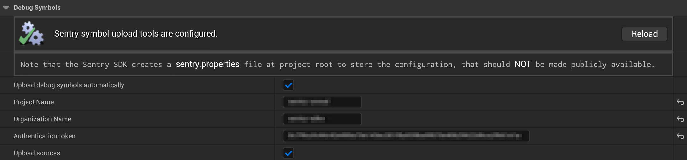

Sentry requires [debug information files](/platforms/unreal/data-management/debug-files/) to symbolicate crashes. The Unreal Engine SDK provides an automated upload functionality for those symbol files that rely on the [sentry-cli](/product/cli/). This is done automatically, so running the `sentry-cli` manually isn't required. The symbol upload happens during the execution of `PostBuildSteps`, as specified in the `Sentry.uplugin` file. The `sentry-cli` executables for Windows, macOS, and Linux are included as part of the Unreal Engine SDK package.

<Note>

For Android, debug symbols upload is handled by [Sentry Android Gradle Plugin](/platforms/android/configuration/gradle).

</Note>

The automated debug symbols upload is disabled by default and requires configuration. To configure it, navigate to **Project Settings > Plugins > Sentry**, then enter the [Auth Token](https://sentry.io/orgredirect/organizations/:orgslug/settings/auth-tokens/), Organization Slug, and Project Name. Note, that the Unreal Engine SDK automatically creates a `sentry.properties` file at the root of your project directory to store the configuration. This configuration file should **never** be made publicly available.



### Manual Upload Using sentry-cli

To upload debug symbols to Sentry manually, run `sentry-cli` through the command line. You can either use the provided executables from within the package, or follow the [sentry-cli documentation](/product/cli/installation/) to make it available globally. To upload debug symbols run the following command:

<OrgAuthTokenNote />

```bash
sentry-cli --auth-token ___ORG_AUTH_TOKEN___ debug-files upload --org ___ORG_SLUG___ --project ___PROJECT_SLUG___ PATH_TO_SYMBOLS
```
