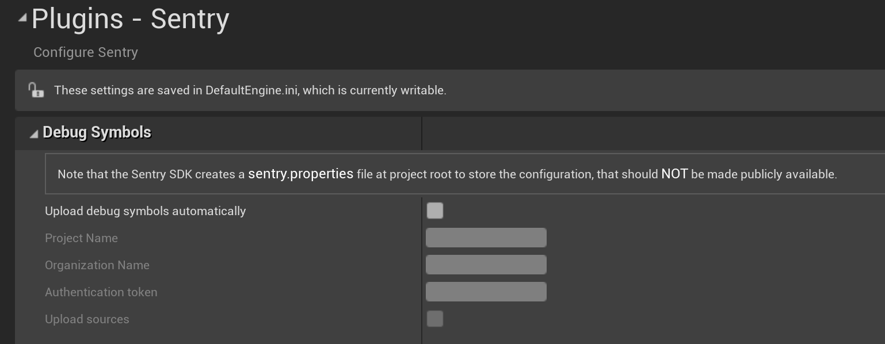

Sentry requires [debug information files](/platforms/unreal/data-management/debug-files/) to symbolicate crashes. The Unreal Engine SDK provides an automated upload functionality for those symbol files that rely on the [sentry-cli](/product/cli/). This is done transparently so running the `sentry-cli` manually is not required. The symbol upload happens during the execution of `PostBuildSteps` specified in `Sentry.uplugin` file. `sentry-cli` executables for Windows, macOS, and Linux are included in the Unreal Engine SDK package.

<Note>

For Android debug symbols upload is handled by [Sentry Android Gradle Plugin](/platforms/android/gradle).

</Note>

The automated debug symbols upload is not enabled by default and requires configuration. Navigate to **Project Settings > Plugins > Sentry** to enter the [Auth Token](https://sentry.io/api/), Organization Slug, and the Project Name. Note that the Unreal Engine SDK automatically creates a `sentry.properties` file at project root directory to store the configuration when editing corresponding values. Configuration file should **not** be made publicly available.



### Manual Upload Using sentry-cli

In order to upload debug symbols to Sentry manually run `sentry-cli` through the commandline. One can use the provided executables from within the package or follow the [sentry-cli documentation](/product/cli/installation/) to make it available globally. To upload debug symbols run the following command:

```bash
sentry-cli --auth-token YOUR_AUTH_TOKEN upload-dif --org ___ORG_SLUG___ --project ___PROJECT_SLUG___ PATH_TO_SYMBOLS
```
