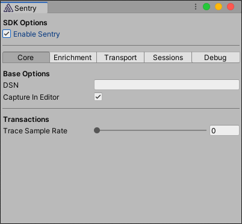

## Installation

Install the package via the [Unity Package Manager using a Git URL](https://docs.unity3d.com/Manual/upm-ui-giturl.html) to Sentry's SDK repository:

```
https://github.com/getsentry/unity.git#{{ packages.version('sentry.dotnet.unity', '0.1.0') }}
```
Confirm the URL doesn't have a trailing whitespace at the end. The Unity Package Manager will fail to find the package if a trailing whitespace is appended.

## Configuration

Access the Sentry configuration window by going to Unity's top menu: `Tools` > `Sentry` and enter the [DSN](/product/sentry-basics/dsn-explainer/).



And that's it! Now Sentry can capture errors automatically.

## Verify

Once it is configured with the DSN you can call the SDK from anywhere:

```csharp
SentrySdk.CaptureMessage("Test event");
```
